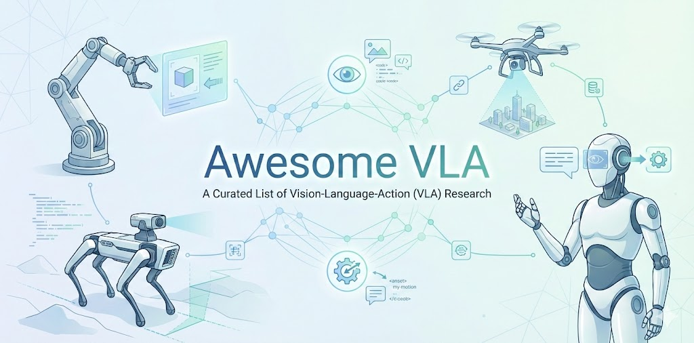

# 🤖 Awesome VLA

**📜 A Curated List of Vision-Language-Action (VLA) Research**  

**🚀 Welcome to follow our exploratory work on VLA, [VLANeXt](https://github.com/DravenALG/VLANeXt).**

  

*Photo Credit: [Gemini-Nano-Banana🍌](https://aistudio.google.com/models/gemini-3-pro-image)*.

## Overview
- 🎯 [Aim](#aim)
- 📚 [Definition](#definition)
- 📖 [Survey](#survey)
- 🧠 [General VLA](#general-vla)
- 🌐 [VLA with 3D Spatial Modelling](#vla-with-3d-spatial-modelling)
- 🔥 [VLA with Post-Training (e.g., RL)](#vla-with-post-training-eg-rl)
- 🧩 [VLA with Intermediate Modelling (e.g., World Modelling, Reasoning)](#vla-with-intermediate-modelling-eg-world-modelling-reasoning)
- 🧪 [VLA with Latent Actions](#vla-with-latent-actions)
- 🪶 [Efficient VLA](#efficient-vla)
- 🧭 [Domain-Specific VLA (e.g., Humanoid, Tactile)](#domain-specific-vla-eg-humanoid-tactile)
- 🧷 [Other Topics in VLA](#other-topics-in-vla)
- 🦾 [Traditional Policies](#traditional-policies)
- 💾 [Datasets](#datasets)
- 📊 [Benchmark / Environment](#benchmark--environment)
- 🏞️ [Physics Engine](#physics-engine)
- 🖥️ [Hardware](#hardware)

## Aim
This is a curated list of VLA research that systematically organizes various topics within the field. It will be continuously updated and refined, with the goal of clarifying the research context for scholars in the VLA domain. If you have any new papers worth adding, please feel free to push and join us in maintaining a high-quality VLA list.

## Definition
In short, VLA models are a type of robotics policy that inherts the pretrained VLMs’ rich language grounding and visual understanding abilities to offter a scalable route toward general-purpose, language-conditioned robot policies. We can trace the origin and formal definition of the VLA to the work TR-2.

- [⭐️] **RT-2**, RT-2: Vision-Language-Action Models Transfer Web Knowledge to Robotic Control.  

## Survey
- Vision-Language-Action (VLA) Models: Concepts, Progress, Applications and Challenges.  

- A Survey on Vision-Language-Action Models for Embodied AI.  

## General VLA

- [⭐️] **ABot-M0** ABot-M0: VLA Foundation Model for Robotic Manipulation with Action Manifold Learning.  

- [⭐️] **Lingbot-VLA** A Pragmatic VLA Foundation Model.  

- **VLM4VLA** VLM4VLA: Revisiting Vision-Language-Models in Vision-Language-Action Models.  

- [⭐️] Emergence of Human to Robot Transfer in Vision-Language-Action Models.  

- [⭐️] **π∗0.6:**, π∗0.6: a VLA That Learns From Experience.  

- **VLA-0**, VLA-0: Building State-of-the-Art VLAs with Zero Modification.  

- **UniVLA**, Unified Vision-Language-Action Model.  

- **SmolVLA**, SmolVLA: A Vision-Language-Action Model for Affordable and Efficient Robotics.  

- **NORA**, NORA: A Small Open-Sourced Generalist Vision Language Action Model for Embodied Tasks.  

- **CronusVLA**, CronusVLA: Towards Efficient and Robust Manipulation via Multi-Frame Vision-Language-Action Modeling.  

- [⭐️] **Gemini Robotics**, Gemini Robotics: Bringing AI into the Physical World.  

- [⭐️] **OpenVLA-OFT**, Fine-Tuning Vision-Language-Action Models: Optimizing Speed and Success.  

- [⭐️] **FAST**, FAST: Efficient Action Tokenization for Vision-Language-Action Models.  

- **CogACT**, CogACT: A Foundational Vision-Language-Action Model for Synergizing Cognition and Action in Robotic Manipulation.  

- **RoboVLMs**, Towards Generalist Robot Policies: What Matters in Building Vision-Language-Action Models.  

- [⭐️] **π0**, π0: A Vision-Language-Action Flow Model for General Robot Control.  

- [⭐️] **OpenVLA**, OpenVLA: An Open-Source Vision-Language-Action Model.  

- **RoboFlamingo**, Vision-Language Foundation Models as Effective Robot Imitators.  

- [⭐️] **RT-2**, RT-2: Vision-Language-Action Models Transfer Web Knowledge to Robotic Control.  

## VLA with 3D Spatial Modelling

- **4D-VLA**, 4D-VLA: Spatiotemporal Vision-Language-Action Pretraining with Cross-Scene Calibration.  

- **3D CAVLA**, 3D CAVLA: Leveraging Depth and 3D Context to Generalize Vision Language Action Models for Unseen Tasks.  

- **SpatialVLA**, SpatialVLA: Exploring Spatial Representations for Visual-Language-Action Model.  

- [⭐️] **3D-VLA**, 3D-VLA: A 3D Vision-Language-Action Generative World Model.  

## VLA with Post-Training (e.g., RL)

- **EVOLVE-VLA**, EVOLVE-VLA: Test-Time Training from Environment Feedback for Vision-Language-Action Models. 

- **AVA-VLA**, AVA-VLA: Improving Vision-Language-Action models with Active Visual Attention. 

- **SRPO**, SRPO: Self-Referential Policy Optimization for Vision-Language-Action Models. 

- **World-Env**, World-Env: Leveraging World Model as a Virtual Environment for VLA Post-Training. 

- **SimpleVLA-RL**, SimpleVLA-RL: Scaling VLA Training via Reinforcement Learning. 

- **VLA-Reasoner**, VLA-Reasoner: Empowering Vision-Language-Action Models with Reasoning via Online Monte Carlo Tree Search. 

- [⭐️] **ThinkAct**, ThinkAct: Vision-Language-Action Reasoning via Reinforced Visual Latent Planning. 

- **TGRPO**, TGRPO :Fine-tuning Vision-Language-Action Model via Trajectory-wise Group Relative Policy Optimization. 

- **VLA-RL**, VLA-RL: Towards Masterful and General Robotic Manipulation with Scalable Reinforcement Learning. 

- **RIPT-VLA**, Interactive Post-Training for Vision-Language-Action Models. 

- **GRAPE**, GRAPE: Generalizing Robot Policy via Preference Alignment. 

## VLA with Intermediate Modelling (e.g., World Modelling, Reasoning)

- [⭐️] **Cosmos Policy**, Cosmos Policy: Fine-Tuning Video Models for Visuomotor Control and Planning.  

- **MM-ACT**, MM-ACT: Learn from Multimodal Parallel Generation to Act.  

- **RynnVLA-002**, RynnVLA-002: A Unified Vision-Language-Action and World Model.  

- **F1**, F1: A Vision-Language-Action Model Bridging Understanding and Generation to Actions.  

- **MolmoAct**, MolmoAct: Action Reasoning Models that can Reason in Space.  

- **FlowVLA**, FlowVLA: Visual Chain of Thought-based Motion Reasoning for Vision-Language-Action Models.  

- **ReconVLA**, ReconVLA: Reconstructive Vision-Language-Action Model as Effective Robot Perceiver.  

- [⭐️] **DreamVLA**, DreamVLA: A Vision-Language-Action Model Dreamed with Comprehensive World Knowledge.  

- [⭐️] **WorldVLA**, WorldVLA: Towards Autoregressive Action World Model.  

- [⭐️] **π0.5**, π0.5: a Vision-Language-Action Model with Open-World Generalization.  

- **CoT-VLA**, CoT-VLA: Visual Chain-of-Thought Reasoning for Vision-Language-Action Models.  

- **ChatVLA**, ChatVLA: Unified Multimodal Understanding and Robot Control with Vision-Language-Action Model.  

- [⭐️] **UP-VLA**, UP-VLA: A Unified Understanding and Prediction Model for Embodied Agent.  

## VLA with Latent Actions

- **Motus**, Motus: A Unified Latent Action World Model.  

- [⭐️] **GR00T N1**, GR00T N1: An Open Foundation Model for Generalist Humanoid Robots.  

- [⭐️] **LAPA**, Latent Action Pretraining from Videos.  

## Efficient VLA

- **MergeVLA**, MergeVLA: Cross-Skill Model Merging Toward a Generalist Vision-Language-Action Agent.  

- **VLA-Adapter**, VLA-Adapter: An Effective Paradigm for Tiny-Scale Vision-Language-Action Model.  

- **FLOWER**, FLOWER: Democratizing Generalist Robot Policies with Efficient Vision-Language-Action Flow Policies.  

- [⭐️] **TinyVLA**, TinyVLA: Towards Fast, Data-Efficient Vision-Language-Action Models for Robotic Manipulation.  

## Domain-Specific VLA (e.g., Humanoid, Tactile)

- **Tactile-VLA**, Tactile-VLA: Unlocking Vision-Language-Action Model's Physical Knowledge for Tactile Generalization. 

- [⭐️] **GR00T N1**, GR00T N1: An Open Foundation Model for Generalist Humanoid Robots.  

- **CombatVLA**, CombatVLA: An Efficient Vision-Language-Action Model for Combat Tasks in 3D Action Role-Playing Games.  

- **Humanoid-VLA**, Humanoid-VLA: Towards Universal Humanoid Control with Visual Integration. 

## Other Topics in VLA

- **DynamicVLA**, DynamicVLA: A Vision-Language-Action Model for Dynamic Object Manipulation.  

- **MemoryVLA**, MemoryVLA: Perceptual-Cognitive Memory in Vision-Language-Action Models for Robotic Manipulation.  

- **TraceVLA**, TraceVLA: Visual Trace Prompting Enhances Spatial-Temporal Awareness for Generalist Robotic Policies.  

## Traditional Policies

- **State-free Policy**, Do You Need Proprioceptive States in Visuomotor Policies?.  

- [⭐️] **UVAM**, Unified Video Action Model.  

- **Seer**, Predictive Inverse Dynamics Models are Scalable Learners for Robotic Manipulation.  

- **GR-2**, GR-2: A Generative Video-Language-Action Model with Web-Scale Knowledge for Robot Manipulation.  

- [⭐️] **RDT-1B**, RDT-1B: a Diffusion Foundation Model for Bimanual Manipulation.  

- **ReKep**, ReKep: Spatio-Temporal Reasoning of Relational Keypoint Constraints for Robotic Manipulation.  

- **HPT**, Scaling Proprioceptive-Visual Learning with Heterogeneous Pre-trained Transformers.  

- **MDT**, Multimodal Diffusion Transformer: Learning Versatile Behavior from Multimodal Goals.  

- [⭐️] **Octo**, Octo: An Open-Source Generalist Robot Policy.  

- **ManiGaussian**, ManiGaussian: Dynamic Gaussian Splatting for Multi-task Robotic Manipulation.  

- [⭐️] **DP3**, 3D Diffusion Policy: Generalizable Visuomotor Policy Learning via Simple 3D Representations.  

- [⭐️] **GR-1**, Unleashing Large-Scale Video Generative Pre-training for Visual Robot Manipulation.  

- [⭐️] **VoxPoser**, VoxPoser: Composable 3D Value Maps for Robotic Manipulation with Language Models.  

- **RPT**, Robot Learning with Sensorimotor Pre-training.  

- [⭐️] **Diffusion Policy**, Diffusion Policy: Visuomotor Policy Learning via Action Diffusion.  

- **UniPi**, Learning Universal Policies via Text-Guided Video Generation.  

- [⭐️] **RT-1**, RT-1: Robotics Transformer for Real-World Control at Scale.  

- [⭐️] **PerAct**, Perceiver-Actor: A Multi-Task Transformer for Robotic Manipulation.  

- **DayDreamer**, DayDreamer: World Models for Physical Robot Learning.  

- [⭐️] **Diffusers**, Planning with Diffusion for Flexible Behavior Synthesis.  

- [⭐️] **Zero-Shot Planner**, Language Models as Zero-Shot Planners: Extracting Actionable Knowledge for Embodied Agents.  

## Datasets

- [⭐️] **DROID**, DROID: A Large-Scale In-The-Wild Robot Manipulation Dataset.  

- [⭐️] **Open X-Embodiment**, Open X-Embodiment: Robotic Learning Datasets and RT-X Models.  

## Benchmark / Environment
- **LIBERO-Plus**, LIBERO-Plus: In-depth Robustness Analysis of Vision-Language-Action Models  

- [⭐️] **RoboTwin 2.0**, RoboTwin 2.0: A Scalable Data Generator and Benchmark with Strong Domain Randomization for Robust Bimanual Robotic Manipulation.  

- [⭐️] **LIBERO**, LIBERO: Benchmarking Knowledge Transfer for Lifelong Robot Learning.  

- [⭐️] **CALVIN**, CALVIN: A Benchmark for Language-Conditioned Policy Learning for Long-Horizon Robot Manipulation Tasks.  

- [⭐️] **SAPIEN**, SAPIEN: A SimulAted Part-based Interactive ENvironment.  (https://sapien.ucsd.edu)

- [⭐️] **RLBench**, RLBench: The Robot Learning Benchmark & Learning Environment. [] 

## Physics Engine

- [⭐️] **Cosmos (neural engine)**, Cosmos World Foundation Model Platform for Physical AI   

- [⭐️] **PhysX**, 

- [⭐️] **MuJoCo**. 

- [⭐️] **PyBullet**. 

## Hardware

- **GELLO**, GELLO: A General, Low-Cost, and Intuitive Teleoperation Framework for Robot Manipulators.  

- [⭐️] **ALOHA**, Learning Fine-Grained Bimanual Manipulation with Low-Cost Hardware.  

## Acknowledgements
Thanks to [Awesome World Models](https://github.com/knightnemo/Awesome-World-Models/tree/main) for the template.

